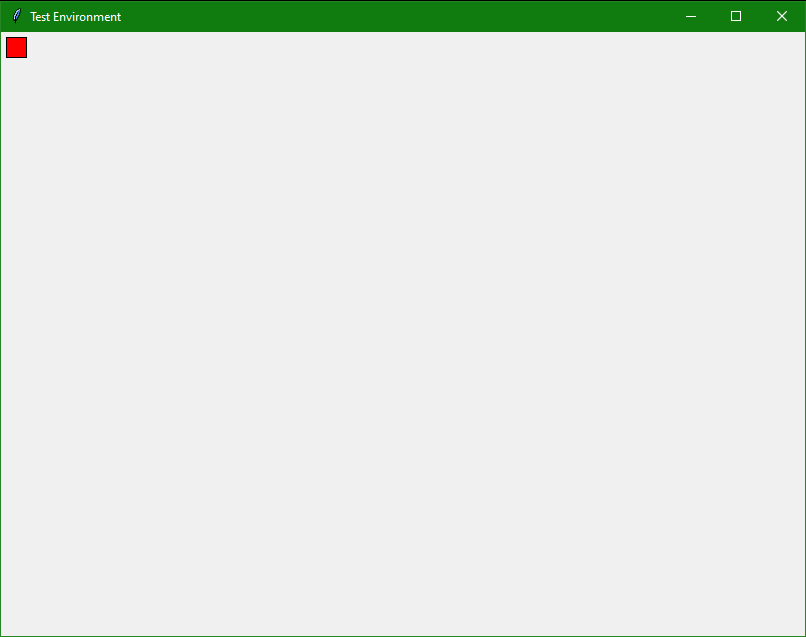
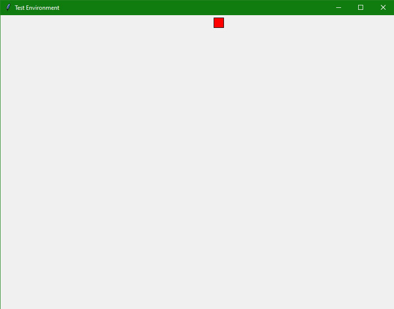
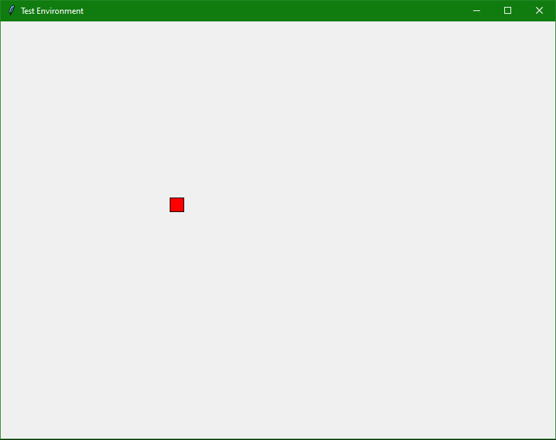

# Tag

## Overview

Currently only a movement environment in which the player can move their sprite

WIP A game of tag between the player and the computer

Made using python and the tkinter module

## Instructions

- arrow keys to move your sprite

## Screenshots

## Future possibilities
- Two player game in with timer, players take turn tagging each other, person who is tagged at the end of the timer loses
